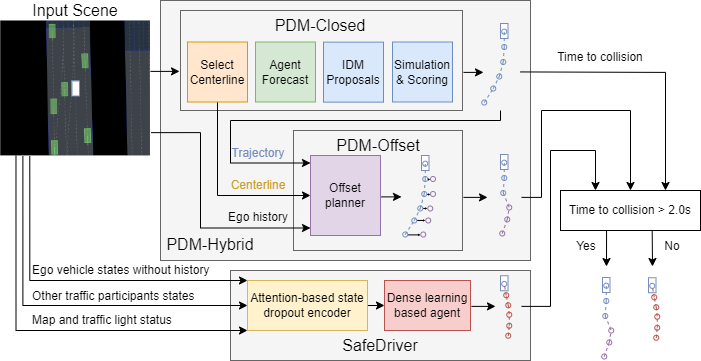
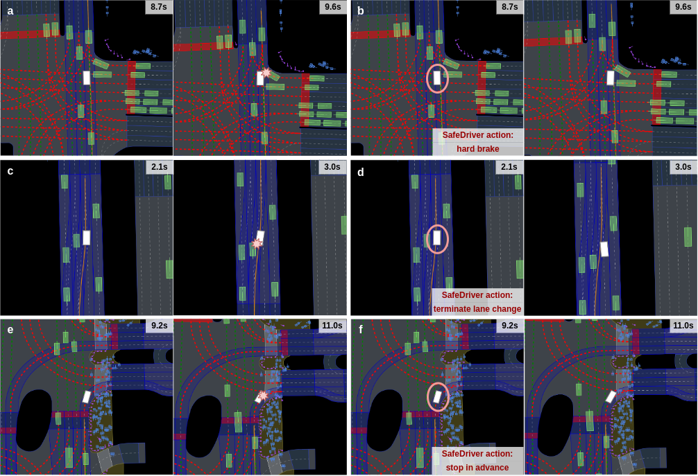

# Dense-Learning-for-nuPlan

## Table of Contents:
1. [Introduction of the Project](#introduction-of-the-project)
    - [Overview](#overview)
2. [System Requirements](#system-requirements)
    - [Hardware](#hardware)
    - [Software](#software)
3. [Getting Started](#getting-started)
    - [Installation](#installation)
    - [Evaluation](#evaluation)
    - [Training](#training)
    - [Results](#results)
3. [License](#license)

<!-- ABOUT THE PROJECT -->
## Introduction of the Project

### Overview
This repository contains the code for the SafeDriver developed in the nuPlan benchmarks, recognized as the world's first extensive planning benchmark for autonomous vehicles. The goal of SafeDriver is to utilize a learning-based planner to assist the base model in navigating through safety-critical scenarios encountered in urban driving. We selected the state-of-the-art (SOTA) planner PDM-Hybrid as our base model to demonstrate the effectiveness of SafeDriver over the SOTA base model. The overall architecture of the PDM-Hybrid with SafeDriver is depicted in the following figure.



## System Requirements

### Hardware
This code can run on a computer with the following hardware configuration:
- RAM: 32+ GB
- CPU: 8+ cores, 3.0+ GHz/core

It is highly recommended to run this code on a High-Performance Computing (HPC) cluster to reduce the time for data collection and training.

### Software
This code is developed and tested under
- Ubuntu 18.04 operating system
- Python 3.9

## Getting Started

### Installation
> The overall installation process should take 15~20 minutes on a recommended computer.

#### 1. Setup the nuPlan dataset and install the nuPlan devkit 
Please setup the nuPlan dataset ([described here](https://nuplan-devkit.readthedocs.io/en/latest/dataset_setup.html)) and install the nuPlan devkit ([see here](https://nuplan-devkit.readthedocs.io/en/latest/installation.html))

#### 2. Download the source code for PDM-Hybrid and install it
- download tuPlan Garage and move inside the folder
    ```
    git clone https://github.com/autonomousvision/tuplan_garage.git && cd tuplan_garage
    ```
- make sure the environment you created when installing the nuplan-devkit is activated
    ```
    conda activate nuplan
    ```
- install the local tuplan_garage as a pip package
    ```
    pip install -e .
    ```

#### 3. Install all required packages 
To install the packages required for this repository, execute the commands provided below:
```bash
cd src && pip install -r requirements.txt
pip install -e .pip install -e .
```

### Evaluation
When running an evaluation, you have to add the `hydra.searchpath` for the `tuplan_garage` and `safedriver_nuplan` correctly.
The example below runs an evaluation of the `SafeDriver` on the `val14_split` scenario.
```bash
export NUPLAN_DATA_ROOT=/path/to/nuPlan/dataset # define the path to the nuplan dataset
export NUPLAN_EXP_ROOT=/path/to/experiment # define the path to the nuplan experiments
export NUPLAN_DEVKIT_ROOT=/path/to/nuplan-devkit # define the path to the nuplan devkit
export DENSE_LEARNING_ROOT=/path/to/Dense-Learning-for-nuPlan # define the path to the Dense-Learning-for-nuPlan
export SAFEDRIVER_ACTIONHEAD_PATH=/path/to/Dense-Learning-for-nuPlan/scripts/simulation/agents/safedriver_actionhead.pt # define the path to the safedriver actionhead
python $NUPLAN_DEVKIT_ROOT/nuplan/planning/script/run_simulation.py \
+simulation=closed_loop_reactive_agents \
planner=pdm_hybrid_with_safedriver_eval \
planner.pdm_hybrid_with_safedriver_eval.checkpoint_path_pdm_offset=$DENSE_LEARNING_ROOT/scripts/simulation/agents/pdm_offset_checkpoint.ckpt \
planner.pdm_hybrid_with_safedriver_eval.checkpoint_path_safedriver_encoder=$DENSE_LEARNING_ROOT/scripts/simulation/agents/safedriver_encoder.ckpt \
scenario_filter=val14_split \
scenario_builder=nuplan \
hydra.searchpath="[pkg://safedriver_nuplan.config, pkg://tuplan_garage.planning.script.config.common, pkg://tuplan_garage.planning.script.config.simulation, pkg://nuplan.planning.script.config.common, pkg://nuplan.planning.script.experiments]"
```
You can find exemplary shells scripts in `./scripts/simulation/pdm_hybrid_with_safedriver_sim.sh`.

### Training
The source code of training the SafeDriver for the nuPlan benchmarks is coming soon. Stay tuned!

### Results
The evaluation results on the Val14 benchmark provided by [this paper](https://arxiv.org/abs/2306.07962) are shown in the following table. Notably, incorporating SafeDriver does not significantly impact the overall scores while greatly enhancing the planner's safety performance. Compared to the base model, SafeDriver reduces the total number of collisions by 21.7\% and decreases AV-responsible crashes by 29.2\%.
| Planner | OLS↑ | NR-CLS↑ | R-CLS↑ | Ego-at-fault crashes in R-CL simulation↓ | All crashes in R-CL simulation↓ |
|-|-|-|-|-|-|
| Base model (PDM-Hybrid) | 83.98 | 92.77 | 92.11 | 24 | 46 |
| Base model with SafeDriver | 83.63 | 92.71 | **92.27** | **17** | **36** |

In the figure below, SafeDriver demonstrates various strategies, such as hard braking and terminating lane changes, to avoid potential crashes with other traffic participants, including vehicles and pedestrians. The ego vehicle is illustrated as a white rectangle, and when controlled by SafeDriver, it is highlighted with a red circle. Green rectangles represent other vehicles, while blue rectangles depict pedestrians. The expert trajectory is shown as an orange curve.

- Subfigure (a): With the base model in control, the ego vehicle continues straight and collides with a right-turning vehicle that does not yield.
- Subfigure (b): In the same scenario as (a), SafeDriver performs a hard brake to avoid the potential collision.
- Subfigure (c): The base model initiates a lane change for the ego vehicle, resulting in a collision with a vehicle in the adjacent lane.
- Subfigure (d): SafeDriver intervenes to stop the lane change in time, preventing the crash.
- Subfigure (e): The base model directs the ego vehicle through a crosswalk, leading to a collision with pedestrians.
- Subfigure (f): Upon encountering pedestrians, SafeDriver proactively yields, providing enough space to avoid a collision.



## License
This code is licensed under the [PolyForm Noncommercial License 1.0.0](LICENSE).